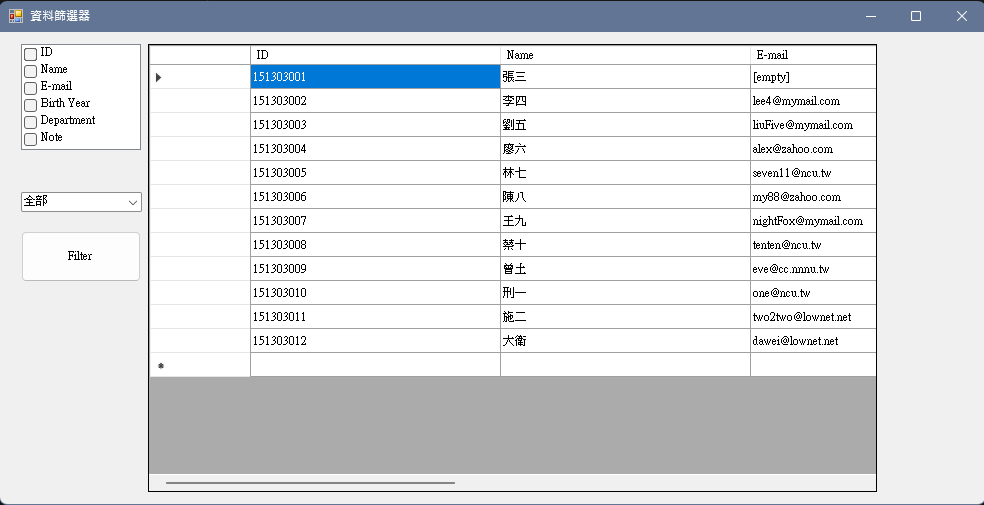
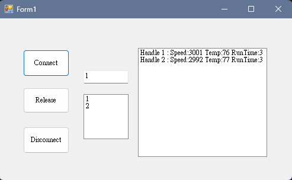

# ncu-course-programmingAndItsAppications
## 簡介
- **學校** : 國立中央大學
- **開課單位** : 機械工程學系
- **課程名稱** : 程式設計與應用
- **授課教授** : 林錦德 助理教授
- **修課時間** : 2021年02月~2021年06月
- **最終成績** : 99

## 成績

| 名稱 | 分數 | 名稱 | 分數 | 名稱 | 分數 |
| ---- | ---- | ---- | ---- | ---- | ---- |
| 作業02 | 100 | 小考02 | 100 | 期中模擬考   | 100 |
| 作業03 | 100 | 小考03 | 100 | 期中考試     | 79 |
| 作業04 | 100 | 小考04 | 100 | 期末考試     | 94 |
| 作業05 | 100 | 小考05 | 100 | 期末觀念測試 | 79.9 |
| 作業07 | 80  | 小考07 | 100 |  |  |
| 作業10 | 100 | 小考10 | 100 |  |  |
| 作業11 | 100 | 小考11 | 100 |  |  |
| 作業12 | 100 | 小考12 | 100 |  |  |
| 作業13 | 95  | 小考13 | 100 |  |  |
| 作業14 | 95  | 小考14 | 100 |  |  |
| 作業15 | 100 | 小考15 | 90  |  |  |
| 作業16 | 100 | 小考16 | 100 |  |  |


## 課程內容
課程內容歸錦德老師所有，本人僅整理出大綱以供自己回顧

1.  Week1  - Hello World! C#
    > 學習C#基礎語法(變數/判斷式/迴圈/陣列/指標/參考)
2.  Week2  - 程式測試與除錯技巧
    > 學習如何使用Visual Studio的除錯功能
3.  Week3  - WINDOWS FORM 設計(1) - 基本Windows Form 設計
    > 學習如何使用Winform中的Container/Tab/TextBox/Timer/Button
4.  Week4  - WINDOWS FORM 設計(2) - 常用控制項介紹與實作
    > 學習如何使用Winform中的Label/CheckBox/ComboBox/ListBox/Event/DataTable
5.  Week5  - 讀寫操作 - 字串操作
    > 學習字串建立/格式化/拆解/正則表示式/型別轉換
6.  Week7  - 讀寫操作 - 檔案系統的操作與管理(2)
    > 學習檔案系統(檔案讀取/資料流)
7.  Week8  - Midterm Mock Exam
8.  Week9  - Midterm Exam
9.  Week10 - 程式設計架構 - 命名空間、物件與DLL
    > 學習命名空間/類別/靜態方法/委派/事件/動態連結檔的製作與使用
10. Week11 - 第三方函式庫(1) - 擷取與顯示麥克風訊號
    > 學習使用第三方函式庫/Chart Control
11. Week12 - 多執行緒程式設計(1) - 使用與控制單一工作執行緒
    > 學習執行緒啟動/控制
12. Week13 - 資源管理 - 物件生命週期與管理，GC 機制
    > 學習物件週期及Garbage Collection(GC)
13. Week14 - 多執行緒程式設計(2) - 多執行緒互動、異常與設計樣本
    > 學習多執行緒的互動/鎖定/死結/非同步程序/異常處理
14. Week15 - 第三方函式庫(2) - 使用第三方組件的注意事項
15. Week16 - 使用SQLite的C語言DLL
16. Week17 - 觀念測試
17. Week18 - Final Exam

## 作業介紹
1. Week02_Debug  
    EX03為二分逼近法，找出原始程式中的部分錯誤，並修正  
    f(x) = x^2 - 2.8x + 5  
    Theoretical Minimum:x=1.4, f(x) = 3.04  
    Program Result: 
    ```
    Find min value 3.04000002518296 at x = 1.39984130859375
    ```

2. Week03_WinFormDesign  
    EX03為模擬機械手臂的狀態及位置，狀態分為靜止/移動/夾持/放置，位置分為原點/輸送帶/紅色倉儲區/綠色倉儲區
    - 夾取紅色(狀態/位置):
        移動/原點 (wait for 5 sec) -> 夾持/紅色倉儲區 (wait for 2 sec) -> 移動/紅色倉儲區 (wait for 8 sec) -> 放置/輸送帶 (wait for 2 sec) -> 移動/輸送帶 (wait for 7 sec) -> 靜止/原點
    - 夾取綠色(狀態/位置):
        移動/原點 (wait for 8 sec) ->綠色倉儲區 (wait for 2 sec) ->綠色倉儲區 (wait for 5 sec) -> 放置/輸送帶 (wait for 2 sec) -> 移動/輸送帶 (wait for 7 sec) -> 靜止/原點
    
    

3. Week04_WinFormDesign2  
    EX04為一個dataGridView，並且具有四個欄位(Name/Height/Weight/Age)，當第一次開啟時會載入預設的10人資料，當使用者按下儲存會保留表格內的資料，載入會恢復上次儲存的資料，若沒有儲存過則是預設資料。
    

4. Week06_StringManipulator  
   HW為一個密碼強度檢察功能視窗，須滿足密碼條件(至少1個英文大寫、至少2個英文小寫、至少2個數字字元)

   

5. Week07_FileSystem  
   HW為一個可以讓使用者選擇資料夾，並且自動計算資料夾下所有檔案及資料夾數量  
   

6. Week10_ProgrammingStructure  
   HW為將Box.dll加入參考，可透過文字框顯示長度寬度發生改變的時間及數值

   

7. Week11_UseNAudio  
   HW為即時錄製聲音樣本，並每100ms計算方均跟數值
   

8. Week12_BasicThread  
   HW為使用者在文字框輸入文字內容並按下按鈕，執行緒會將文字內容呈現在第一個文字框裡面

   

9. Week13_ResourceManagement  
    HW為設計一個能夠寫入資料的類別(MyDataWriter)，當異常狀態發生(未正常關閉檔案)皆能釋放資源

   

10. Week14_AdvancedThreadingProgramming  
    避免兩個線程搶占資源，透過資源方式來避免
    
    ```
    Thrd#3: 預備從帳戶_A_轉帳到帳戶_B_，轉帳金額100
    Thrd#3: 預備lock 資源: _A_
    Thrd#3: 已經lock 資源: _A_
    Thrd#3: 預備lock 資源: _B_
    Thrd#3: 已經lock 資源: _B_
    Thrd#4: 預備從帳戶_B_轉帳到帳戶_A_，轉帳金額10
    Thrd#4: 預備lock 資源: _B_
    Thrd#3: 從帳戶_A_提出100, 餘額:900
    Thrd#3: 從帳戶_B_存入100, 餘額:1100
    Thrd#3: unlock 資源: _B_
    Thrd#3: unlock 資源: _A_
    Thrd#3: 完成從帳戶_A_轉帳到帳戶_B_，轉帳金額100
    Thrd#3: 預備從帳戶_A_轉帳到帳戶_B_，轉帳金額100
    Thrd#3: 預備lock 資源: _A_
    Thrd#3: 已經lock 資源: _A_
    Thrd#3: 預備lock 資源: _B_
    Thrd#4: 已經lock 資源: _B_
    Thrd#4: 預備lock 資源: _A_
    ```

11. Week15_UseFFT  
    僅需繳交使用FFT函式時的注意事項

    [Notice_FFT](./Week15_UseFFT/HW/108303013.txt)

## 小考介紹
1. Week02_Exam  
    採用黃金比例法來求根號值，找出原始程式中的部分錯誤，並修正
    ```
    Input a value between 0 and 10 to find its root:2
    The root of [2] is 1.41421615290795
    ```

2. Week03_Exam  
   設計一個計算機，具有十三個按鍵(0~9, +, =, CE)，並可以讓使用者進行加法運算，按下CE時會清除結果  
   

3. Week04_Exam  
   設計一個資料篩選器，可以挑選資料表格中對應的欄位出來或是對應的系所
   

4. Week06_Exam  
   設計一個Numerical Control(NC) Program可以將G-Code中的座標透過regular expression提取出來  
   [G-Code資料](./Week06_Exam/Test06.txt)  
   

5. Week07_Exam  
   設計一個座標轉換程式，可以將原本的直角座標(x, y, z)，轉換成球座標(r, theta, phi)並輸出成二進制檔案(LittleEndian or Big Endian)  
   [直角坐標資料](./Week07_Exam/data/points.txt)  
   

6. Week08_MidtermMockExam
    1. 找出原始程式中矩陣乘積的錯誤，使專案可以正確執行
    
    2. 根據輸入的數字轉換成進度條(0~128)，
        - num<70，進度條以綠色呈現
        - 70<num<100，進度條以黃色呈現
        - 100<num，進度條以紅色呈現
        
        
    3. 找出以下條件
        - 字尾具有"ed"的單字，並呈現在文字框
        - 找出所有西元年份，並將加總結果呈現在文字框
        
        
    4. 解析WAV音訊格式的大小及建立時間

        

7. Week09_MidtermExam  
    題目卷被收回

8. Week10_ProgrammingStructure  
    共分為三個專案，輸出dll，輸出exe及完成1A2B的遊戲

    

9. Week11_UseNAudio  
    將作業的單聲道改成雙聲道，並且可以設定聲音強度門檻，當超過門檻時，將紀錄的聲道/時間/強度寫入log.txt  
    

10. Week12_BasicThread  
    將Week11_UseNAudio作業的內容改成按下開始錄音，再按一次則停止錄音。錄音過程中，執行緒會持續寫入使用者指定的檔案

    

11. Week13_ResourceManagement  
    可以透過與CncSimulator.dll取得handle，模擬多個CNC機台返回速度/溫度/執行時間，並且最大同時連線數為3

    

12. Week14_AdvancedThreadingProgramming  
    解決執行緒異常(檔案不存在/檔案被占用)

    

13. Week15_UseFFT  
    可錄製聲音，並存檔成WAV格式(取樣率44100Hz, 樣本深度16-bits, 單聲道)，可選擇開一份WAV格式的檔案，並經過濾波器後，重新存成Filtered.WAV  
    

14. Week16_UsingSQLite  
    使用dllImport建立sqlite3_open、sqlite3_close、sqlite3_exec與sqlite3_free，並且可以完成"Insert into record Values ('Age','30') "。執行完成後，使用SQLLiteStudio查看week16.db可以看已添增的數值

    

15. Week18_FinalExam
    1. 分析資料夾中學生的檔案，檔案中具有一萬筆資料(學號/生日/手機號碼/學校Email)，學號須由9位數字組成，生日須由YYYY-MM-DD，手機號碼須由4位數字，6位數字中間以"-"分隔。若資料符合則移動至OK，否則記錄錯誤資訊到log.txt
    
        

    2. 將data.csv檔案中的時間/訊號強度繪製出來，並且將原始訊號/FFT訊號/Filter後訊號繪圖到winForm
        
    
    3. 設計StudentInfo，並輸出StudentInfo.dll
        ```
        BBBBBB AAA was born on 1979/10/17 上午 12:00:00, and his/her id is 111111111
        2025-06-26
        16689.4986898425 days from birthday.
        DDDDD CCC was born on 2021/6/21 上午 12:00:00, and his/her id is 999999999
        ```

## 開發環境與需求
- Visual Studio
- .NETFramework,Version=v4.8
- SQLiteStudio  
  Week16_Exam中會使用到SQLiteStudio查看database  
  [SQLiteStudio - Official Website](https://sqlitestudio.pl/)
- DLL/DB位置  
  為了簡化重複上傳部分不必要的文件，請自行複製dll/database
  - Week09_MidtermExam
    ``` sh
    cp ncu-course-programmingAndItsApplications/Week09_MidtermExam/data/student_info.csv ncu-course-programmingAndItsApplications/Week09_MidtermExam/Program_4/bin/Debug
    ```
    
  - Week10_ProgrammingStructure
    ``` sh
    cp ncu-course-programmingAndItsApplications/Week10_ProgrammingStructure/HW/data/* ncu-course-programmingAndItsApplications/Week10_ProgrammingStructure/HW/HW/bin/Debug
    ```
  
  - Week13_Exam
    ``` sh
    cp ncu-course-programmingAndItsApplications/Week13_Exam/data/* ncu-course-programmingAndItsApplications/Week13_Exam/Test13/bin/Debug
    ```

  - Week16_Exam
    ``` sh
    cp ncu-course-programmingAndItsApplications/Week16_Exam/data/* ncu-course-programmingAndItsApplications/Week16_Exam/bin/Debug
    ```
  - Week18_FinalExam
    ``` sh
    cp ncu-course-programmingAndItsApplications/Week18_FinalExam/data/data.csv ncu-course-programmingAndItsApplications/Week18_FinalExam/Test02/bin/Debug
    ```
## 修課心得
我是大推錦德老師的所有課程!這門的loading其實算蠻重，畢竟很多時候都需要自己看完課前影片並完成作業，上課時間會拿來小考，老師會更改作業中的部分內容並需要現場實做出來。老師的影片算是很用心在錄影片及教材讓人淺顯易懂的學會c#及winform的基礎。走完這學期算是很有感的學會一門程式語言，雖然現在(修完課的4年)回過頭來看，有些內容又還給老師，但至少需要用到的時候還可以回來翻講義。